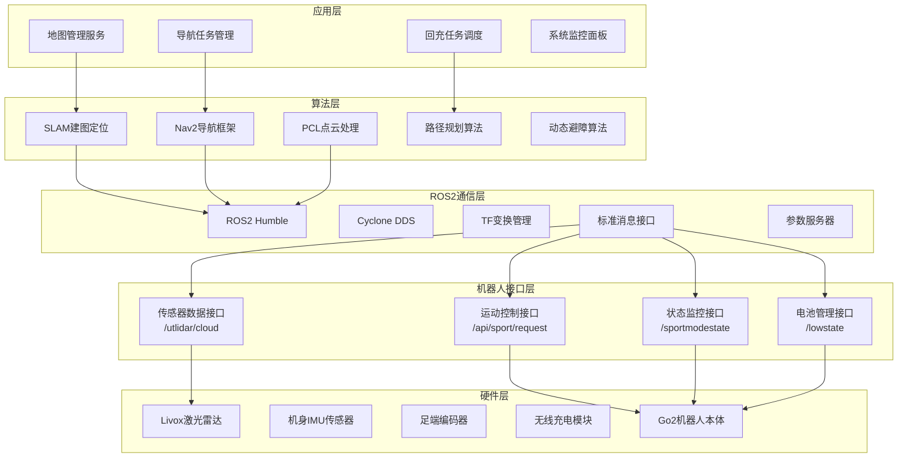
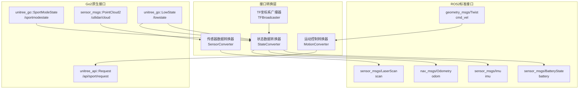
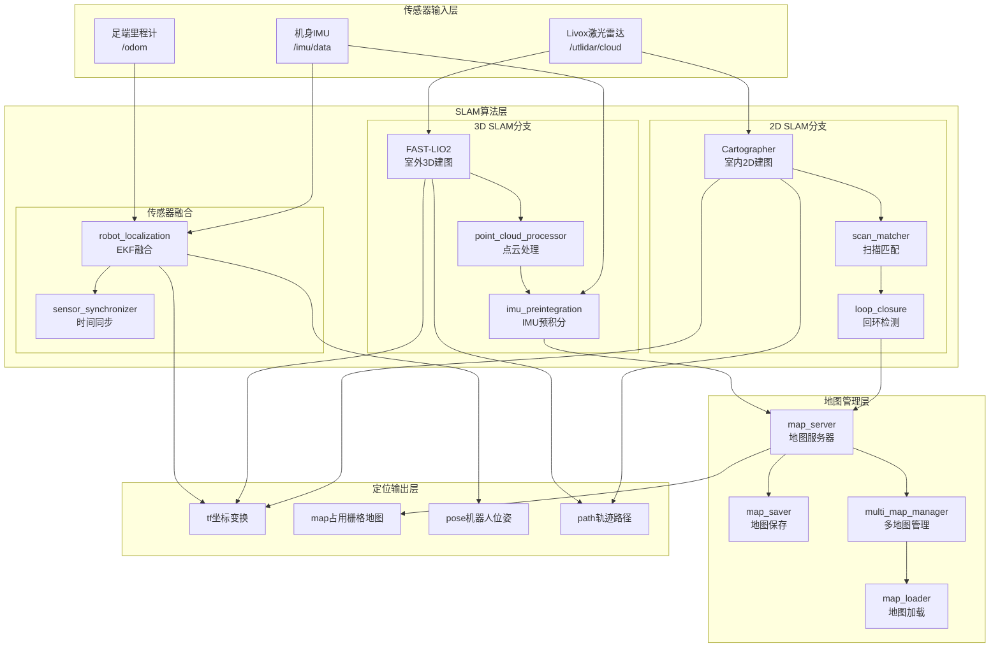
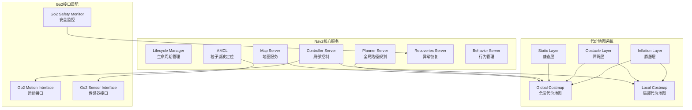
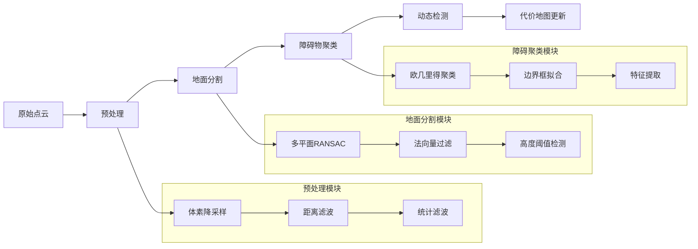
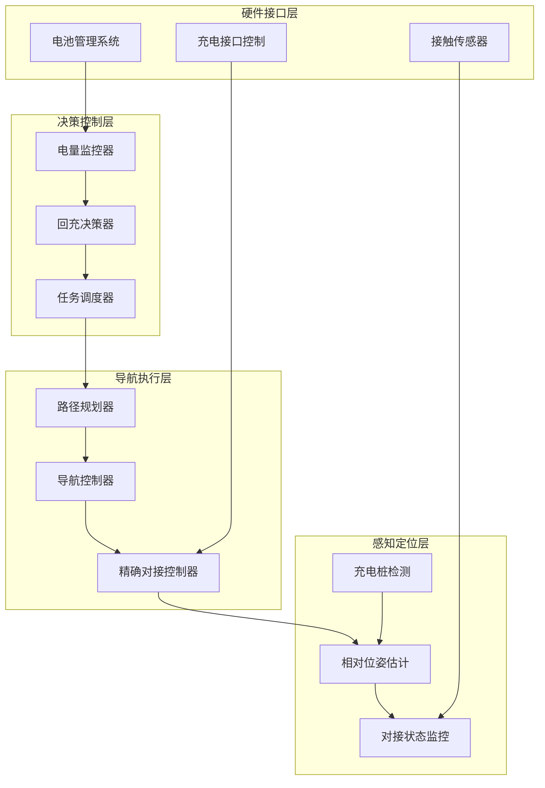
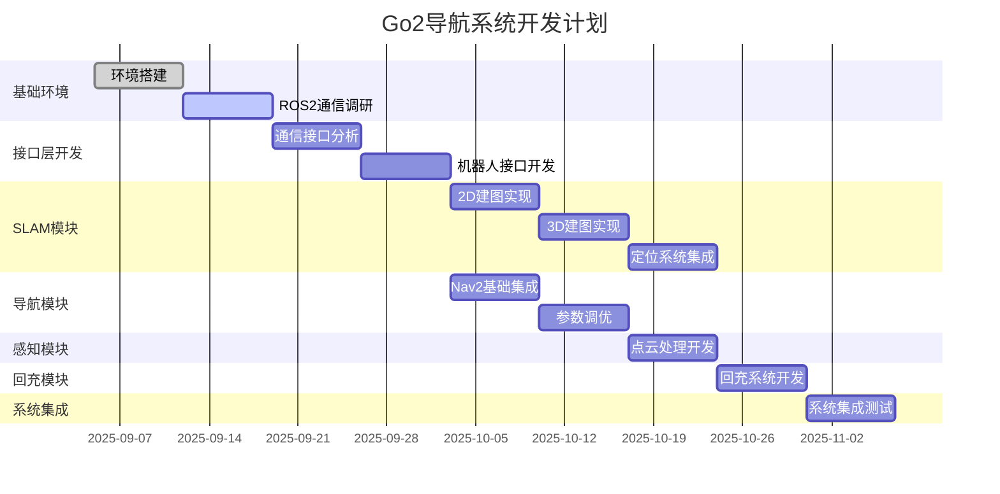

# 宇树Go2四足机器人自主导航系统技术文档

## 1. 项目概述

### 1.1 项目目标

基于宇树Go2四足机器人平台，开发具备自主导航、动态避障、SLAM建图和自主回充功能的完整导航系统。系统将直接利用Go2机器人的ROS2兼容特性，通过标准ROS2接口实现高效的机器人控制和数据通信。

### 1.2 核心功能

- **自主导航**：基于Nav2框架的路径规划与跟踪
- **SLAM建图**：2D/3D环境建图与实时定位
- **动态避障**：基于激光雷达的实时障碍检测与规避
- **自主回充**：低电量自动返回充电桩并精确对接
- **多地图管理**：支持室内外多环境地图切换

### 1.3 技术特色

- **直接ROS2通信**：利用Go2底层DDS兼容性，实现低延迟通信
- **简化架构设计**：减少中间转换层，提高系统响应速度
- **标准接口集成**：充分利用ROS2生态的成熟算法包
- **高性能保证**：基于Cyclone DDS的零拷贝通信机制

---

## 2. 系统架构设计

### 2.1 整体架构

系统采用四层架构设计，直接利用Go2的ROS2兼容特性：

**应用层**负责高级业务逻辑，包括导航任务管理、地图管理服务、回充任务调度和系统监控面板。

**算法层**集成成熟的ROS2算法包，包括SLAM建图定位、Nav2导航框架、PCL点云处理、路径规划算法和动态避障算法。

**ROS2通信层**基于Cyclone DDS实现高效的消息传递，提供TF变换管理、标准消息接口和参数服务器功能。

**机器人接口层**直接使用Go2提供的ROS2话题接口，包括运动控制、状态监控、传感器数据和电池管理。

### 2.2 关键设计原则

#### 2.2.1 直接通信架构

- **去中介化**：移除SDK适配层，直接使用ROS2话题通信
- **标准化接口**：采用unitree_api和unitree_go标准消息格式
- **零拷贝传输**：利用DDS的共享内存机制提高传输效率

#### 2.2.2 模块化设计

- **松耦合架构**：各功能模块通过标准ROS2接口连接
- **热插拔支持**：支持模块独立开发、测试和部署
- **扩展性保证**：便于后续功能扩展和算法升级

#### 2.2.3 实时性优化

- **并行处理**：传感器数据处理与运动控制并行执行
- **优先级调度**：关键路径任务享有更高的处理优先级
- **缓存策略**：合理使用缓存减少重复计算开销

---

## 3. 核心模块技术方案

### 3.1 机器人通信接口

#### 3.1.1 通信架构选择

采用Go2官方提供的unitree_ros2通信方案，通过标准ROS2话题实现机器人控制和状态获取。运动控制通过发布Request消息到sport服务实现，状态监控通过订阅sportmodestate和lowstate话题获取，传感器数据通过订阅相应的激光雷达和IMU话题获取。

#### 3.1.2 网络配置策略

系统采用有线以太网连接方式，通过配置Cyclone DDS网络接口实现稳定通信。需要正确设置网络接口名称和IP地址段，确保与Go2机器人的网络连通性。

#### 3.1.3 消息格式标准化

直接使用unitree_api和unitree_go定义的标准消息格式，避免自定义消息带来的兼容性问题。在必要时进行坐标系转换和单位换算，保证与ROS2标准的一致性。

### 3.2 SLAM建图与定位

#### 3.2.1 多方案技术架构

针对不同应用场景采用不同的SLAM技术方案。室内环境优先使用Cartographer进行2D建图，具有较高的精度和稳定性。室外复杂环境采用FAST-LIO2进行3D建图，能够处理动态环境和复杂地形。备用方案包括ORB-SLAM3视觉SLAM，用于GPS拒止环境。

#### 3.2.2 传感器融合策略

采用激光雷达作为主要传感器，IMU提供运动约束，足端里程计提供运动估计。通过robot_localization包实现多传感器数据融合，提高定位精度和鲁棒性。

#### 3.2.3 地图管理机制

实现多地图存储和管理机制，支持室内外地图的自动切换。采用分层地图结构，包括全局地图、局部地图和动态障碍物层。提供地图保存、加载和更新功能。

### 3.3 导航路径规划

#### 3.3.1 Nav2框架集成

采用ROS2官方的Nav2导航框架作为核心导航系统。Nav2提供完整的导航功能栈，包括全局路径规划、局部路径规划、行为管理和异常恢复机制。

#### 3.3.2 规划算法选择

全局路径规划采用Dijkstra或A*算法的变种，根据地图复杂度动态选择。局部路径规划使用DWB控制器，适应四足机器人的运动特性。提供多种规划算法的切换机制。

#### 3.3.3 代价地图构建

构建分层代价地图系统，包括静态障碍物层、动态障碍物层和膨胀层。实时更新动态障碍物信息，为路径规划提供准确的环境表示。

### 3.4 动态感知避障

#### 3.4.1 点云处理流水线

建立完整的点云数据处理流水线，包括数据预处理、地面分割、障碍物检测和动态目标跟踪。采用PCL点云库进行高效的点云处理。

#### 3.4.2 障碍物检测算法

采用基于几何特征的障碍物检测算法，结合聚类分析识别不同类型的障碍物。实现静态障碍物和动态障碍物的分类识别。

#### 3.4.3 动态目标跟踪

实现基于卡尔曼滤波的动态目标跟踪算法，预测动态障碍物的运动轨迹。结合数据关联算法实现多目标跟踪。

### 3.5 自主回充系统

#### 3.5.1 电量管理策略

实现智能电量管理系统，根据当前电量、任务需求和返回距离决定回充时机。建立功耗模型，预测剩余续航时间。

#### 3.5.2 充电桩定位导航

采用分阶段导航策略实现精确对接。远距离阶段使用SLAM定位导航，中距离阶段采用视觉或激光特征导航，近距离阶段使用精确对接算法。

#### 3.5.3 对接控制算法

实现基于力反馈的精确对接控制算法，通过接触检测和位置调整实现可靠的充电连接。提供多次尝试和异常处理机制。

---

## 4. 技术选型决策

### 4.1 核心技术选型矩阵

在底层控制方面，选择直接ROS2通信而非SDK适配，原因是官方支持且性能更优，备选方案是SDK适配器，风险评估为低。

在2D SLAM方面，选择Cartographer因其成熟稳定且室内效果优秀，备选方案包括gmapping和hector_slam，风险评估为低。

在3D SLAM方面，选择FAST-LIO2因其实时性强且适合动态环境，备选方案包括LIO-SAM和LOAM，风险评估为中等。

在导航框架方面，选择Nav2因其是ROS2原生且生态完善，备选方案是move_base移植版本，风险评估为低。

### 4.2 通信中间件选择

采用Cyclone DDS作为ROS2的DDS实现，原因是Go2机器人底层基于Cyclone DDS 0.10.2版本，保证通信兼容性。需要正确配置DDS参数以实现最佳性能。

### 4.3 开发工具链选择

采用标准ROS2开发工具链，包括colcon构建系统、ament包管理、ros2命令行工具等。使用Docker容器化部署，保证开发环境一致性。

---

## 5. 开发实施规划

### 5.1 整体时间线（12周）

**基础环境搭建（第1-2周）**：完成ROS2环境配置、unitree_ros2库安装、网络连接测试和基础通信验证。

**机器人接口开发（第3-4周）**：实现运动控制接口、状态监控接口、传感器数据接口和坐标系转换。

**SLAM系统集成（第5-7周）**：集成Cartographer 2D建图、FAST-LIO2 3D建图、多传感器融合和地图管理功能。

**导航系统开发（第8-9周）**：集成Nav2框架、参数调优、路径规划算法选择和代价地图配置。

**感知避障开发（第10周）**：实现点云处理、障碍物检测、动态跟踪和避障策略。

**回充系统开发（第11周）**：实现电量管理、充电桩导航、精确对接和异常处理。

**系统集成测试（第12周）**：完整系统联调、性能测试、稳定性验证和文档整理。

### 5.2 关键里程碑定义

第2周末：Go2机器人ROS2通信环境搭建完成，能够通过ROS2话题控制机器人基本运动。

第4周末：机器人接口层开发完成，实现ROS2标准消息与Go2通信协议的双向转换。

第7周末：SLAM建图功能完成，室内外环境建图精度满足导航需求。

第9周末：Nav2导航系统集成完成，能够在已知地图中实现自主导航。

第10周末：动态避障功能完成，能够实时检测并避开动态障碍物。

第11周末：自主回充功能完成，实现低电量自动返回和精确对接。

第12周末：完整系统集成测试通过，满足项目验收标准。

### 5.3 风险缓解策略

**技术风险**方面，针对ROS2通信兼容性问题，提前进行深度技术调研，准备SDK适配的备用方案。针对实时性能问题，采用分阶段性能测试，及时优化关键路径。

**进度风险**方面，针对功能复杂度超预期，准备简化版本方案，采用敏捷开发方法分阶段交付。针对调试时间过长，建立完善的仿真环境，减少真机调试依赖。

**集成风险**方面，采用持续集成策略，每周进行模块集成测试，及早发现接口问题。

---

## 6. 性能指标与验收标准

### 6.1 技术性能目标

**通信性能**：系统控制延迟目标15-25ms，相比SDK适配方案提升60-70%；数据吞吐量目标达到DDS理论性能的80%以上。

**导航精度**：室内2D SLAM定位精度目标±5cm，室外3D SLAM定位精度目标±10cm；路径规划成功率目标>95%；导航任务完成率目标>90%。

**避障能力**：静态障碍避障成功率目标>98%；动态障碍避障成功率目标>90%；避障反应时间目标<500ms。

**回充性能**：自主回充成功率目标>90%；对接精度目标±10mm；回充决策准确率目标>95%。

**系统稳定性**：连续运行时间目标>12小时；平均无故障时间目标>50小时；系统恢复时间目标<60秒。

### 6.2 用户体验目标

**易用性**：系统部署时间目标<2小时；首次建图时间目标<30分钟；参数调优难度保持在中等水平。

**可维护性**：故障诊断时间目标<10分钟；系统升级时间目标<30分钟；远程诊断成功率目标>90%。

**扩展性**：支持新功能集成，保持中等难度；支持第三方算法集成；预留多机器人协作接口。

---

## 7. 项目交付成果

### 7.1 软件交付物

**核心代码包**：完整的Go2导航系统ROS2工作空间，包括机器人接口、SLAM工具集、感知避障模块和自主回充系统。

**配置数据**：针对Go2优化的参数配置文件、传感器标定数据、测试环境地图和Docker部署镜像。

### 7.2 文档交付物

**技术文档**：系统架构设计、API接口说明、参数配置指南和故障排查手册。

**用户文档**：快速开始指南、操作手册、开发者指南和性能测试报告。

### 7.3 技术支持服务

提供3个月的技术支持期，包括部署协助、问题解决、远程诊断和版本更新服务。建立长期的技术交流和经验分享平台。

---

## 8. 总结

本技术方案充分利用了Go2机器人的ROS2兼容特性，通过直接使用标准ROS2接口实现高性能的机器人导航系统。相比传统SDK适配方案，新方案在系统架构上更加简洁，在通信性能上有显著提升，在开发效率上更加高效。

通过12周的分阶段开发，将交付一个完整、稳定、高性能的四足机器人自主导航系统，为Go2机器人在各种应用场景中的部署提供可靠的技术基础。