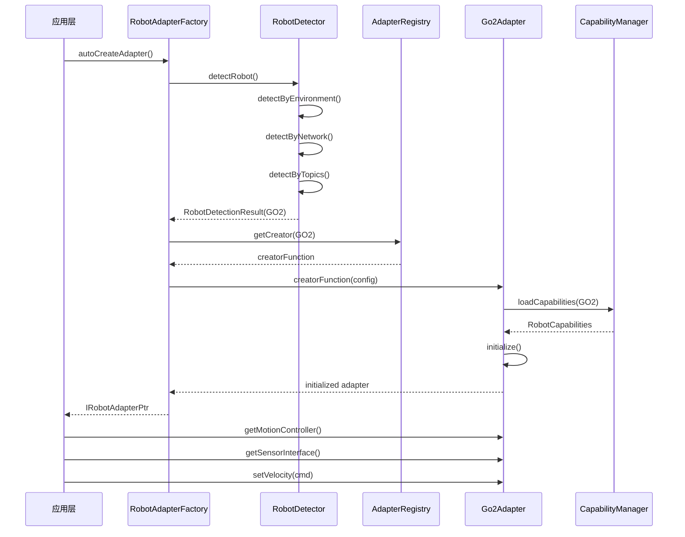

# Robot Factory 架构设计文档

**版本**: 1.0
**作者**: Yang Nan
**日期**: 2025-09-11
**项目**: ROS2机器人导航系统

---

## 目录

1. [概述](#概述)
2. [架构总览](#架构总览)
3. [核心组件详解](#核心组件详解)
4. [与robot_base_interfaces的关系](#与robot_base_interfaces的关系)
5. [与robot_adapters的关系](#与robot_adapters的关系)
6. [设计模式和原理](#设计模式和原理)
7. [数据流和工作流程](#数据流和工作流程)
8. [扩展性设计](#扩展性设计)
9. [配置和部署](#配置和部署)
10. [最佳实践](#最佳实践)

---

## 概述

`robot_factory` 是本项目机器人接口层的核心架构模块，实现了完整的工厂设计模式来解决多机器人平台的统一接入问题。它包含三个紧密协作的ROS2包：

- **`robot_detector`**: 自动检测和识别机器人类型
- **`adapter_factory`**: 适配器工厂，创建和管理机器人适配器
- **`capability_manager`**: 机器人能力管理和查询

该架构的核心价值在于：

1. **统一抽象**: 为不同机器人平台提供一致的接口
2. **自动适配**: 无需手动配置即可识别和适配机器人
3. **动态扩展**: 支持新机器人平台的插件式接入
4. **能力驱动**: 基于机器人能力进行智能任务分配

---

## 架构总览

### 整体架构图

```
┌─────────────────────────────────────────────────────────────┐
│                    应用层 (Applications)                     │
│  ┌─────────────┐ ┌─────────────┐ ┌─────────────┐            │
│  │ 任务管理器    │ │ 导航核心     │ │ 感知核心     │            │
│  └─────────────┘ └─────────────┘ └─────────────┘            │
└─────────────────────┬───────────────────────────────────────┘
                      │ 统一接口访问
                      ▼
┌─────────────────────────────────────────────────────────────┐
│                   robot_factory                             │
│  ┌─────────────────┬─────────────────┬───────────────────┐  │
│  │ robot_detector  │ adapter_factory │capability_manager │  │
│  │                 │                 │                   │  │
│  │ • 机器人检测      │ • 适配器创建     │ • 能力定义          │  │
│  │ • 类型识别       │ • 工厂管理       │ • 能力查询          │  │
│  │ • 网络发现       │ • 生命周期       │ • 配置加载          │  │
│  └─────────────────┴─────────────────┴───────────────────┘  │
└─────────────────────┬───────────────────────────────────────┘
                      │ 创建具体适配器
                      ▼
┌─────────────────────────────────────────────────────────────┐
│               robot_adapters (具体实现)                      │
│  ┌─────────────┐ ┌─────────────┐ ┌──────────────┐           │
│  │ go2_adapter │ │spot_adapter │ │anymal_adapter│           │
│  │             │ │  (预留)      │ │   (预留)     │           │
│  └─────────────┘ └─────────────┘ └──────────────┘           │
└─────────────────────┬───────────────────────────────────────┘
                      │ 实现标准接口
                      ▼
┌─────────────────────────────────────────────────────────────┐
│              robot_base_interfaces                          │
│  ┌─────────────────┬─────────────────┬─────────────────┐    │
│  │motion_interface │sensor_interface │ state_interface │    │
│  │power_interface  │                 │                 │    │
│  └─────────────────┴─────────────────┴─────────────────┘    │
└─────────────────────────────────────────────────────────────┘
```

### 三层架构模式

1. **抽象接口层** (`robot_base_interfaces`): 定义标准化接口契约
2. **工厂管理层** (`robot_factory`): 实现动态创建和管理逻辑
3. **具体实现层** (`robot_adapters`): 提供特定机器人的适配器实现

---

## 核心组件详解

### 1. robot_detector (机器人检测器)

#### 1.1 核心职责

- **自动发现**: 扫描网络环境，自动发现可用的机器人设备
- **类型识别**: 通过多种策略准确识别机器人类型
- **状态验证**: 验证机器人连接状态和可操作性

#### 1.2 关键类结构

```cpp
// 核心检测器类
class RobotDetector {
public:
    RobotDetectionResult detectRobot();
    std::vector<RobotDetectionResult> detectMultipleRobots();
    bool verifyRobotConnection(RobotType type);
  
private:
    // 多策略检测方法
    RobotDetectionResult detectByEnvironment();
    RobotDetectionResult detectByNetwork();
    RobotDetectionResult detectByTopics();
    RobotDetectionResult detectByConfig();
};

// 检测结果结构
struct RobotDetectionResult {
    bool is_detected = false;
    RobotType robot_type = RobotType::GENERIC;
    std::string robot_name;
    std::string network_address;
    float confidence_score = 0.0f;
    std::string detection_method;
    std::map<std::string, std::string> additional_info;
};
```

#### 1.3 检测策略详解

**策略1: 环境变量检测**

```cpp
// 检查 ROBOT_TYPE 环境变量
std::string robot_env = std::getenv("ROBOT_TYPE");
if (robot_env == "go2") {
    return RobotDetectionResult{true, RobotType::GO2, "go2", "", 0.95f, "environment"};
}
```

**策略2: 网络设备发现**

```cpp
// 扫描特定IP段和端口
bool pingResult = networkUtils.ping("192.168.123.18");
bool portOpen = networkUtils.isPortOpen("192.168.123.18", 8080);
if (pingResult && portOpen) {
    // 进一步验证设备类型
}
```

**策略3: ROS2话题特征检测**

```cpp
// 检查Go2特征性话题
std::vector<std::string> go2_topics = {
    "/sportmodestate", "/lowstate", "/api/sport/request", "/utlidar/cloud"
};
auto available_topics = ros2_utils.getActiveTopics();
int matched_topics = countTopicMatches(go2_topics, available_topics);
if (matched_topics >= 3) {
    return RobotDetectionResult{true, RobotType::GO2, "go2", "", 0.8f, "topics"};
}
```

#### 1.4 扩展机制

新机器人检测支持只需：

1. 在 `robot_types.hpp` 中添加新的常量定义
2. 在 `RobotDetector` 中实现对应的 `detectXXXRobot()` 方法
3. 更新检测策略优先级和置信度评分

### 2. adapter_factory (适配器工厂)

#### 2.1 核心职责

- **统一创建**: 提供统一的适配器创建入口
- **生命周期管理**: 管理适配器的初始化、运行和销毁
- **扩展支持**: 支持新适配器类型的动态注册
- **配置管理**: 处理适配器创建和运行的各类配置

#### 2.2 关键类结构

```cpp
// 主工厂类
class RobotAdapterFactory {
public:
    // 主要创建方法
    AdapterCreationResult createAdapter(const AdapterCreationConfig& config);
    AdapterCreationResult createAdapter(RobotType robot_type, const AdapterCreationConfig& config);
  
    // 注册和扩展
    bool registerAdapterCreator(RobotType robot_type, AdapterCreator creator);
    std::vector<RobotType> getSupportedRobotTypes() const;
  
    // 静态便捷方法
    static IRobotAdapterPtr autoCreateAdapter();
    static IRobotAdapterPtr quickCreateGo2Adapter(const std::string& robot_ip);

private:
    std::map<RobotType, AdapterCreator> adapter_creators_;
    std::shared_ptr<robot_detector::RobotDetector> robot_detector_;
    AdapterCreationConfig default_config_;
};

// 基础适配器接口
class IRobotAdapter {
public:
    // 生命周期管理
    virtual bool initialize() = 0;
    virtual bool shutdown() = 0;
    virtual bool isOperational() const = 0;
  
    // 功能接口访问
    virtual std::shared_ptr<IMotionController> getMotionController() = 0;
    virtual std::shared_ptr<ISensorInterface> getSensorInterface() = 0;
    virtual std::shared_ptr<IStateMonitor> getStateMonitor() = 0;
    virtual std::shared_ptr<IPowerManager> getPowerManager() = 0;
  
    // 元信息查询
    virtual RobotType getRobotType() const = 0;
    virtual MotionCapabilities getMotionCapabilities() const = 0;
};
```

#### 2.3 注册机制详解

**动态注册示例** (在Go2适配器包中):

```cpp
// go2_adapter_plugin.cpp
namespace {
struct Go2AdapterRegistrar {
    Go2AdapterRegistrar() {
        auto& factory = RobotAdapterFactory::getInstance();
        factory.registerAdapterCreator(
            RobotType::GO2,
            [](const AdapterCreationConfig& config) -> IRobotAdapterPtr {
                auto adapter = std::make_shared<Go2Adapter>(config);
                if (!adapter->initialize()) {
                    return nullptr;
                }
                return adapter;
            }
        );
    }
} g_go2_registrar;  // 全局对象，程序启动时自动注册
}
```

#### 2.4 配置系统

```cpp
struct AdapterCreationConfig {
    // 网络配置
    std::string robot_ip = "192.168.123.18";
    int robot_port = 8080;
    std::string network_interface = "eth0";
  
    // DDS配置 (Go2特有)
    std::string rmw_implementation = "rmw_cyclonedds_cpp";
    std::string cyclonedds_uri;
  
    // 调试和可靠性
    bool enable_debug_logging = false;
    bool auto_reconnect = true;
    int max_reconnect_attempts = 3;
  
    // 扩展参数
    std::map<std::string, std::string> custom_parameters;
};
```

### 3. capability_manager (能力管理器)

#### 3.1 核心职责

- **能力定义**: 定义机器人各项能力的标准数据结构
- **配置加载**: 从配置文件加载机器人能力矩阵
- **能力查询**: 为上层应用提供机器人能力查询服务
- **能力比较**: 支持机器人能力的比较和匹配

#### 3.2 关键类结构

```cpp
// 能力管理器
class CapabilityManager {
public:
    // 能力查询
    RobotCapabilities getRobotCapabilities(RobotType robot_type) const;
    bool hasCapability(RobotType robot_type, const std::string& capability_name) const;
    CapabilityLevel getCapabilityLevel(RobotType robot_type, CapabilityType type) const;
  
    // 配置管理
    bool loadCapabilityMatrix(const std::string& config_file);
    bool validateCapabilities(const RobotCapabilities& capabilities) const;
  
    // 能力比较和匹配
    std::vector<RobotType> findRobotsWithCapability(const std::string& capability_name) const;
    float calculateCapabilityMatch(const RequiredCapabilities& requirements, 
                                  RobotType robot_type) const;

private:
    std::map<RobotType, RobotCapabilities> capability_matrix_;
    CapabilityLoader loader_;
};

// 综合能力结构
struct RobotCapabilities {
    MotionCapabilities motion;
    SensorCapabilities sensors;
    PowerCapabilities power;
    CommunicationCapabilities communication;
    std::map<std::string, CapabilityLevel> custom_capabilities;
};
```

#### 3.3 能力配置文件示例

```yaml
# config/capability_matrix.yaml
robots:
  go2:
    motion:
      max_linear_velocity: 1.5      # m/s
      max_angular_velocity: 2.0     # rad/s
      max_lateral_velocity: 0.5     # m/s
      can_climb_stairs: true
      can_balance: true
      supported_gaits:
        - walk
        - trot
        - bound
      body_height_range: [0.08, 0.32]  # m
    
    sensors:
      lidar:
        type: "livox_mid360"
        max_range: 40.0             # m
        accuracy: 0.02              # m
        frequency: 10.0             # Hz
        field_of_view: 360          # degrees
      imu:
        type: "built_in"
        frequency: 400.0            # Hz
        accuracy: 0.01              # degrees
      cameras:
        - type: "rgb_fisheye"
          resolution: [1280, 720]
          frequency: 30.0           # fps
        
    power:
      battery_capacity: 15000       # mAh
      battery_voltage: 14.8         # V
      max_power_consumption: 400    # W
      charging_types:
        - wireless
        - contact
      estimated_runtime: 120        # minutes
    
    communication:
      supported_protocols:
        - ros2_cyclonedds
        - tcp_ip
      network_interfaces:
        - ethernet
        - wifi
      max_range: 100                # m (WiFi)
      data_rate: 100                # Mbps
    
    custom_capabilities:
      quadruped_tricks: "advanced"
      autonomous_charging: "basic"
      multi_robot_coordination: "intermediate"
```

---

## 与robot_base_interfaces的关系

### 依赖关系图

```
robot_factory (依赖)
    ↓
robot_base_interfaces (接口定义)
    ↑
robot_adapters (实现)
```

### 接口契约

`robot_factory` 中的所有组件都严格依赖 `robot_base_interfaces` 定义的接口：

1. **类型系统统一**: 使用 `robot_base_interfaces::motion_interface::RobotType`
2. **接口规范统一**: 适配器必须实现 `IMotionController`, `ISensorInterface` 等
3. **数据结构统一**: 使用标准的 `MotionCapabilities`, `SensorInfo` 等结构

### 具体依赖示例

```cpp
// robot_factory/adapter_factory/i_robot_adapter.hpp
#include "robot_base_interfaces/motion_interface/i_motion_controller.hpp"
#include "robot_base_interfaces/sensor_interface/i_sensor_interface.hpp"
// ...

class IRobotAdapter {
    virtual std::shared_ptr<robot_base_interfaces::motion_interface::IMotionController> 
        getMotionController() = 0;
    // ...
};
```

### 设计原则

1. **接口隔离**: 工厂只依赖接口，不依赖具体实现
2. **依赖倒置**: 高层模块(工厂)不依赖底层模块(具体适配器)
3. **开闭原则**: 对扩展开放，对修改关闭

---

## 与robot_adapters的关系

### 协作模式

```
robot_factory (创建者)  ←→  robot_adapters (被创建者)
     ↓ 创建                     ↓ 注册
IRobotAdapter ←────────── Go2Adapter, SpotAdapter, ...
```

### 注册和创建流程

1. **启动时注册**: 各适配器包在启动时自动注册创建函数
2. **按需创建**: 工厂根据检测结果创建对应适配器
3. **生命周期管理**: 工厂负责适配器的初始化和资源清理

### Go2Adapter集成示例

```cpp
// 在go2_adapter包中
class Go2Adapter : public IRobotAdapter {
public:
    Go2Adapter(const AdapterCreationConfig& config);
  
    bool initialize() override {
        // 1. 初始化ROS2节点和DDS配置
        setupRos2Environment(config_);
      
        // 2. 创建各功能模块
        motion_controller_ = std::make_shared<Go2MotionController>(config_);
        sensor_interface_ = std::make_shared<Go2SensorInterface>(config_);
        state_monitor_ = std::make_shared<Go2StateMonitor>(config_);
        power_manager_ = std::make_shared<Go2PowerManager>(config_);
      
        // 3. 验证连接和功能
        return verifyConnection() && verifyFunctionality();
    }
  
    std::shared_ptr<IMotionController> getMotionController() override {
        return motion_controller_;
    }
  
    RobotType getRobotType() const override {
        return RobotType::GO2;
    }
  
private:
    AdapterCreationConfig config_;
    std::shared_ptr<Go2MotionController> motion_controller_;
    std::shared_ptr<Go2SensorInterface> sensor_interface_;
    // ...
};
```

---

## 设计模式和原理

### 1. 工厂模式 (Factory Pattern)

#### 经典工厂方法模式

```cpp
// 抽象工厂
class IAdapterFactory {
public:
    virtual IRobotAdapterPtr createAdapter() = 0;
};

// 具体工厂
class Go2AdapterFactory : public IAdapterFactory {
public:
    IRobotAdapterPtr createAdapter() override {
        return std::make_shared<Go2Adapter>();
    }
};
```

#### 本项目的混合模式

结合了**简单工厂**、**工厂方法**和**注册表模式**的优势：

```cpp
class RobotAdapterFactory {
    // 简单工厂的便利性
    IRobotAdapterPtr createAdapter(RobotType type);
  
    // 工厂方法的可扩展性  
    bool registerAdapterCreator(RobotType type, AdapterCreator creator);
  
    // 注册表的动态性
    std::map<RobotType, AdapterCreator> adapter_creators_;
};
```

### 2. 单例模式 (Singleton Pattern)

确保工厂、检测器、能力管理器的全局唯一性：

```cpp
class RobotAdapterFactory {
public:
    static RobotAdapterFactory& getInstance() {
        static RobotAdapterFactory instance;
        return instance;
    }
  
private:
    RobotAdapterFactory() = default;
    RobotAdapterFactory(const RobotAdapterFactory&) = delete;
    RobotAdapterFactory& operator=(const RobotAdapterFactory&) = delete;
};
```

### 3. 适配器模式 (Adapter Pattern)

每个具体的 `XxxAdapter` 都是适配器模式的实现：

```cpp
// 目标接口 (本系统的统一接口)
class IMotionController {
public:
    virtual bool setVelocity(const Velocity& vel) = 0;
};

// 被适配者 (Go2的原始接口)
class UnitreeGo2API {
public:
    void sendSportRequest(const unitree_api::msg::Request& req);
};

// 适配器 (将Go2 API适配为统一接口)
class Go2MotionController : public IMotionController {
public:
    bool setVelocity(const Velocity& vel) override {
        // 转换数据格式
        unitree_api::msg::Request request;
        request.velocity[0] = vel.linear_x;
        request.velocity[1] = vel.linear_y;
        request.velocity[2] = vel.angular_z;
      
        // 调用原始接口
        go2_api_.sendSportRequest(request);
        return true;
    }
  
private:
    UnitreeGo2API go2_api_;
};
```

### 4. 策略模式 (Strategy Pattern)

在机器人检测中应用策略模式：

```cpp
class RobotDetector {
public:
    RobotDetectionResult detectRobot() {
        // 尝试不同的检测策略
        for (auto& strategy : detection_strategies_) {
            auto result = strategy->detect();
            if (result.is_detected && result.confidence_score > threshold_) {
                return result;
            }
        }
        return RobotDetectionResult{false};
    }

private:
    std::vector<std::unique_ptr<IDetectionStrategy>> detection_strategies_;
};

class IDetectionStrategy {
public:
    virtual RobotDetectionResult detect() = 0;
};

class NetworkDetectionStrategy : public IDetectionStrategy {
public:
    RobotDetectionResult detect() override {
        // 网络检测实现
    }
};
```

### 5. 门面模式 (Facade Pattern)

`RobotAdapterFactory` 为复杂的创建过程提供简化接口：

```cpp
// 复杂的内部操作
class RobotAdapterFactory {
private:
    RobotDetectionResult detectRobot();
    bool validateConfig(const Config& config);  
    IRobotAdapterPtr createSpecificAdapter(RobotType type);
    bool initializeAdapter(IRobotAdapterPtr adapter);
  
public:
    // 简单的外部接口
    static IRobotAdapterPtr autoCreateAdapter() {
        // 内部处理所有复杂逻辑
        auto& factory = getInstance();
        auto detection = factory.detectRobot();
        auto config = factory.generateConfig(detection);
        auto adapter = factory.createSpecificAdapter(detection.robot_type);
        factory.initializeAdapter(adapter);
        return adapter;
    }
};
```

---

## 数据流和工作流程

### 完整创建流程



### 关键数据流转

#### 1. 检测阶段数据流

```
环境变量 → 
网络扫描 → 
ROS2话题 → 
配置文件 → 
    ↓
RobotDetectionResult {
    robot_type: GO2,
    confidence: 0.9,
    network_address: "192.168.123.18",
    detection_method: "network"
}
```

#### 2. 创建阶段数据流

```
AdapterCreationConfig {
    robot_ip: "192.168.123.18",
    network_interface: "eth0",
    cyclonedds_uri: "...",
    enable_debug: false
} → Go2Adapter → IRobotAdapter
```

#### 3. 能力查询数据流

```
capability_matrix.yaml → 
CapabilityManager → 
RobotCapabilities {
    motion: { max_velocity: 1.5, ... },
    sensors: { lidar: {...}, imu: {...} },
    power: { battery_capacity: 15000, ... }
}
```

### 错误处理流程

```cpp
AdapterCreationResult RobotAdapterFactory::createAdapter(const Config& config) {
    try {
        // 1. 参数验证
        if (!validateConfig(config)) {
            return AdapterCreationResult(false, "Invalid configuration");
        }
      
        // 2. 机器人检测
        auto detection = robot_detector_->detectRobot();
        if (!detection.is_detected) {
            return AdapterCreationResult(false, "No robot detected");
        }
      
        // 3. 创建适配器
        auto creator = getCreator(detection.robot_type);
        if (!creator) {
            return AdapterCreationResult(false, "Unsupported robot type");
        }
      
        auto adapter = creator(config);
        if (!adapter || !adapter->initialize()) {
            return AdapterCreationResult(false, "Adapter initialization failed");
        }
      
        return AdapterCreationResult(true, "", adapter);
      
    } catch (const std::exception& e) {
        return AdapterCreationResult(false, "Exception: " + std::string(e.what()));
    }
}
```

---

## 扩展性设计

### 新机器人平台接入指南

#### 步骤1: 定义机器人类型

```cpp
// robot_base_interfaces/motion_interface/motion_types.hpp
enum class RobotType {
    GENERIC = 0,
    GO2 = 1,
    SPOT = 2,
    ANYMAL = 3,
    NEW_ROBOT = 4  // ← 新增
};
```

#### 步骤2: 添加检测支持

```cpp
// robot_factory/robot_detector/robot_types.hpp  
namespace new_robot_constants {
    const std::string DEFAULT_IP = "192.168.1.100";
    const std::vector<std::string> SIGNATURE_TOPICS = {
        "/new_robot/state",
        "/new_robot/cmd_vel"  
    };
}

// robot_detector.cpp
RobotDetectionResult RobotDetector::detectNewRobot() {
    // 实现新机器人的检测逻辑
}
```

#### 步骤3: 创建适配器实现

```cpp
// robot_adapters/new_robot_adapter/
class NewRobotAdapter : public IRobotAdapter {
public:
    bool initialize() override;
    std::shared_ptr<IMotionController> getMotionController() override;
    // ... 实现所有必需接口
};
```

#### 步骤4: 注册适配器

```cpp
// new_robot_adapter_plugin.cpp
namespace {
struct NewRobotRegistrar {
    NewRobotRegistrar() {
        RobotAdapterFactory::getInstance().registerAdapterCreator(
            RobotType::NEW_ROBOT,
            [](const AdapterCreationConfig& config) {
                return std::make_shared<NewRobotAdapter>(config);
            }
        );
    }
} g_registrar;
}
```

#### 步骤5: 添加能力配置

```yaml
# capability_matrix.yaml
robots:
  new_robot:
    motion:
      max_linear_velocity: 2.0
      # ... 其他能力参数
```

### 插件机制设计

为了支持运行时动态加载适配器，设计了插件接口：

```cpp
// plugin_interface.hpp
class IAdapterPlugin {
public:
    virtual ~IAdapterPlugin() = default;
    virtual std::string getPluginName() const = 0;
    virtual std::vector<RobotType> getSupportedRobots() const = 0;
    virtual IRobotAdapterPtr createAdapter(RobotType type, const Config& config) = 0;
    virtual bool initialize() = 0;
    virtual void shutdown() = 0;
};

// plugin_manager.hpp
class PluginManager {
public:
    bool loadPlugin(const std::string& plugin_path);
    bool unloadPlugin(const std::string& plugin_name);
    std::vector<IAdapterPlugin*> getLoadedPlugins() const;
  
private:
    std::map<std::string, std::unique_ptr<IAdapterPlugin>> plugins_;
    std::map<std::string, void*> plugin_handles_;  // dlopen handles
};
```

---

## 配置和部署

### 配置文件结构

```
config/
├── robot_factory/
│   ├── factory_config.yaml        # 工厂全局配置
│   ├── detection_config.yaml      # 检测器配置  
│   └── capability_matrix.yaml     # 能力矩阵
├── robot_adapters/
│   ├── go2_adapter_config.yaml    # Go2适配器配置
│   └── generic_adapter_config.yaml
└── network/
    ├── dds_config.xml             # DDS网络配置
    └── cyclonedds_config.xml       # CycloneDDS配置
```

### 关键配置示例

#### factory_config.yaml

```yaml
robot_factory:
  detection:
    enable_auto_detection: true
    detection_timeout_ms: 10000
    preferred_strategies:
      - environment
      - network  
      - topics
    confidence_threshold: 0.7
  
  adapter_creation:
    default_timeout_ms: 5000
    auto_reconnect: true
    max_reconnect_attempts: 3
    enable_statistics: true
  
  logging:
    log_level: INFO
    enable_file_logging: true
    log_file_path: "/var/log/robot_factory.log"
    max_log_file_size_mb: 100
```

#### detection_config.yaml

```yaml
detection:
  strategies:
    environment:
      enabled: true
      priority: 1
      environment_variables:
        - ROBOT_TYPE
        - ROS_ROBOT_TYPE
      
    network:
      enabled: true
      priority: 2
      scan_ranges:
        - "192.168.123.0/24"   # Go2默认网段
        - "192.168.80.0/24"    # Spot默认网段
      ping_timeout_ms: 1000
      port_scan_timeout_ms: 500
    
    topics:
      enabled: true
      priority: 3
      topic_discovery_timeout_ms: 5000
      min_topic_matches: 2
    
  robot_signatures:
    go2:
      network:
        default_ips:
          - "192.168.123.18"
        ports: [8080, 8081]
      topics:
        required:
          - "/sportmodestate"
          - "/lowstate"  
        optional:
          - "/api/sport/request"
          - "/utlidar/cloud"
```

### 环境部署

#### Docker部署配置

```dockerfile
# Dockerfile.robot_factory
FROM ros:humble-base

# 安装依赖
RUN apt-get update && apt-get install -y \
    cyclonedds-dev \
    yaml-cpp-dev \
    && rm -rf /var/lib/apt/lists/*

# 复制源码
COPY src/robot_interfaces /opt/robot_ws/src/robot_interfaces
WORKDIR /opt/robot_ws

# 编译
RUN source /opt/ros/humble/setup.bash && \
    colcon build --packages-select robot_base_interfaces robot_factory

# 运行时配置
ENV ROS_DOMAIN_ID=0
ENV RMW_IMPLEMENTATION=rmw_cyclonedds_cpp
ENV CYCLONEDDS_URI=file:///opt/robot_ws/config/cyclonedds_config.xml

ENTRYPOINT ["/opt/robot_ws/entrypoint.sh"]
```

#### 网络配置脚本

```bash
#!/bin/bash
# scripts/setup_network.sh

# 检测可用网络接口
AVAILABLE_INTERFACES=$(ip link show | awk -F: '$0 !~ "lo|vir|doc|wl"{print $2}' | tr -d ' ')

echo "Available network interfaces:"
echo "$AVAILABLE_INTERFACES"

# 自动选择合适的接口
for iface in $AVAILABLE_INTERFACES; do
    if ip route | grep -q "default.*$iface"; then
        export ROBOT_NETWORK_INTERFACE=$iface
        echo "Selected network interface: $iface"
        break
    fi
done

# 设置DDS配置
export CYCLONEDDS_URI="<CYCLONEDDS><Domain><General><Interfaces><NetworkInterface name=\"$ROBOT_NETWORK_INTERFACE\" priority=\"default\" multicast=\"default\" /></Interfaces></General></Domain></CYCLONEDDS>"

# 验证网络配置
if ping -c 1 -W 1 192.168.123.18 >/dev/null 2>&1; then
    echo "Go2 robot detected at 192.168.123.18"
    export ROBOT_TYPE=go2
fi

echo "Network setup complete"
```

---

## 最佳实践

### 1. 适配器开发最佳实践

#### 接口实现

```cpp
class MyRobotAdapter : public IRobotAdapter {
public:
    MyRobotAdapter(const AdapterCreationConfig& config) : config_(config) {
        // 构造函数只保存配置，不执行复杂初始化
    }
  
    bool initialize() override {
        try {
            // 1. 验证配置
            if (!validateConfig()) {
                setLastError("Invalid configuration");
                return false;  
            }
          
            // 2. 建立连接
            if (!establishConnection()) {
                setLastError("Failed to connect to robot");
                return false;
            }
          
            // 3. 初始化各模块 (使用RAII)
            motion_controller_ = std::make_unique<MyMotionController>(config_);
            sensor_interface_ = std::make_unique<MySensorInterface>(config_);
          
            // 4. 验证功能
            if (!verifyFunctionality()) {
                setLastError("Functionality verification failed");
                return false;
            }
          
            is_initialized_ = true;
            return true;
          
        } catch (const std::exception& e) {
            setLastError("Exception during initialization: " + std::string(e.what()));
            return false;
        }
    }
  
    bool shutdown() override {
        // 安全关闭，逆序释放资源
        is_initialized_ = false;
        sensor_interface_.reset();
        motion_controller_.reset();
        closeConnection();
        return true;
    }
  
private:
    bool validateConfig() const {
        return !config_.robot_ip.empty() && config_.robot_port > 0;
    }
  
    bool is_initialized_ = false;
    AdapterCreationConfig config_;
    std::unique_ptr<MyMotionController> motion_controller_;
    std::unique_ptr<MySensorInterface> sensor_interface_;
};
```

#### 错误处理策略

```cpp
class RobustAdapter : public IRobotAdapter {
private:
    // 统一错误处理
    template<typename Func>
    auto safeExecute(Func&& func) -> decltype(func()) {
        try {
            return func();
        } catch (const CommunicationException& e) {
            setLastError("Communication error: " + std::string(e.what()));
            // 尝试重连
            if (auto_reconnect_enabled_) {
                attemptReconnection();  
            }
            throw;
        } catch (const std::exception& e) {
            setLastError("Unexpected error: " + std::string(e.what()));
            throw;
        }
    }
  
public:
    bool setVelocity(const Velocity& vel) override {
        return safeExecute([&]() {
            validateVelocity(vel);
            return sendVelocityCommand(vel);
        });
    }
};
```

### 2. 性能优化最佳实践

#### 延迟初始化

```cpp
class LazyAdapter : public IRobotAdapter {
public:
    std::shared_ptr<IMotionController> getMotionController() override {
        if (!motion_controller_) {
            motion_controller_ = createMotionController();
        }
        return motion_controller_;
    }
  
private:
    mutable std::shared_ptr<IMotionController> motion_controller_;
    std::shared_ptr<IMotionController> createMotionController() const {
        // 延迟创建，只在需要时初始化
    }
};
```

#### 连接池管理

```cpp
class ConnectionPooledAdapter {
private:
    class ConnectionPool {
    public:
        ConnectionPtr getConnection() {
            std::lock_guard<std::mutex> lock(mutex_);
            if (available_connections_.empty()) {
                return createNewConnection();
            }
          
            auto conn = available_connections_.back();
            available_connections_.pop_back();
            return conn;
        }
      
        void returnConnection(ConnectionPtr conn) {
            std::lock_guard<std::mutex> lock(mutex_);
            if (conn && conn->isHealthy()) {
                available_connections_.push_back(conn);
            }
        }
      
    private:
        std::vector<ConnectionPtr> available_connections_;
        std::mutex mutex_;
    };
  
    static ConnectionPool& getConnectionPool() {
        static ConnectionPool pool;
        return pool;  
    }
};
```

### 3. 测试最佳实践

#### 模拟适配器

```cpp
class MockRobotAdapter : public IRobotAdapter {
public:
    MockRobotAdapter() : is_initialized_(true) {}  // 总是初始化成功
  
    bool initialize() override { return true; }
    bool shutdown() override { return true; }
    bool isOperational() const override { return is_operational_; }
  
    // 提供测试控制接口
    void setOperational(bool operational) { is_operational_ = operational; }
    void simulateError(const std::string& error) { last_error_ = error; }
  
    std::shared_ptr<IMotionController> getMotionController() override {
        if (!motion_controller_) {
            motion_controller_ = std::make_shared<MockMotionController>();
        }
        return motion_controller_;
    }
  
private:
    bool is_operational_ = true;
    std::shared_ptr<MockMotionController> motion_controller_;
};
```

#### 集成测试

```cpp
class AdapterIntegrationTest : public ::testing::Test {
protected:
    void SetUp() override {
        // 设置测试环境
        setenv("ROBOT_TYPE", "go2", 1);
      
        config_.robot_ip = "127.0.0.1";  // 使用本地回环
        config_.enable_debug_logging = true;
      
        factory_ = &RobotAdapterFactory::getInstance();
    }
  
    void TearDown() override {
        unsetenv("ROBOT_TYPE");
    }
  
    AdapterCreationConfig config_;
    RobotAdapterFactory* factory_;
};

TEST_F(AdapterIntegrationTest, CreateGo2AdapterSuccess) {
    auto result = factory_->createAdapter(RobotType::GO2, config_);
  
    ASSERT_TRUE(result.success);
    ASSERT_NE(result.adapter, nullptr);
    EXPECT_EQ(result.detected_robot_type, RobotType::GO2);
  
    // 测试基本功能
    EXPECT_TRUE(result.adapter->isInitialized());
    EXPECT_TRUE(result.adapter->isOperational());
  
    auto motion_controller = result.adapter->getMotionController();
    ASSERT_NE(motion_controller, nullptr);
    EXPECT_EQ(motion_controller->getRobotType(), RobotType::GO2);
}
```

### 4. 部署最佳实践

#### 健康检查

```cpp
class HealthChecker {
public:
    struct HealthStatus {
        bool is_healthy = false;
        std::string status_message;
        std::map<std::string, bool> component_status;
        double response_time_ms = 0.0;
    };
  
    HealthStatus checkAdapterHealth(IRobotAdapterPtr adapter) {
        auto start = std::chrono::high_resolution_clock::now();
      
        HealthStatus status;
        status.component_status["adapter"] = adapter && adapter->isOperational();
        status.component_status["connection"] = adapter && adapter->isConnected();
      
        if (auto motion = adapter->getMotionController()) {
            status.component_status["motion"] = motion->isOperational();
        }
      
        auto end = std::chrono::high_resolution_clock::now();
        status.response_time_ms = std::chrono::duration<double, std::milli>(end - start).count();
      
        status.is_healthy = std::all_of(status.component_status.begin(), 
                                      status.component_status.end(),
                                      [](const auto& pair) { return pair.second; });
      
        return status;
    }
};
```

#### 监控和日志

```cpp
class AdapterMonitor {
public:
    void startMonitoring(IRobotAdapterPtr adapter) {
        monitoring_thread_ = std::thread([this, adapter]() {
            while (is_monitoring_) {
                auto health = health_checker_.checkAdapterHealth(adapter);
                logHealthStatus(health);
              
                if (!health.is_healthy) {
                    notifyHealthIssue(health);
                }
              
                std::this_thread::sleep_for(std::chrono::seconds(monitoring_interval_));
            }
        });
    }
  
private:
    void logHealthStatus(const HealthStatus& status) {
        RCLCPP_INFO_STREAM(logger_, 
            "Adapter health: " << (status.is_healthy ? "HEALTHY" : "UNHEALTHY") 
            << ", response_time: " << status.response_time_ms << "ms");
    }
  
    std::thread monitoring_thread_;
    std::atomic<bool> is_monitoring_{false};
    int monitoring_interval_ = 5;  // seconds
    HealthChecker health_checker_;
};
```

---

## 总结

本 `robot_factory` 架构通过精心设计的三包协作模式，成功实现了：

1. **统一性**: 不同机器人平台的统一抽象和管理
2. **自动性**: 机器人类型的自动检测和适配器创建
3. **扩展性**: 新机器人平台的快速接入和集成
4. **可靠性**: 完善的错误处理和恢复机制
5. **性能**: 高效的资源管理和通信优化

该架构不仅解决了当前Go2机器人的接入需求，更为未来多机器人平台的统一管理奠定了坚实的技术基础。通过工厂模式、适配器模式等经典设计模式的有机组合，实现了高内聚、低耦合的架构设计，为整个机器人导航系统提供了稳定可靠的基础设施支撑。
